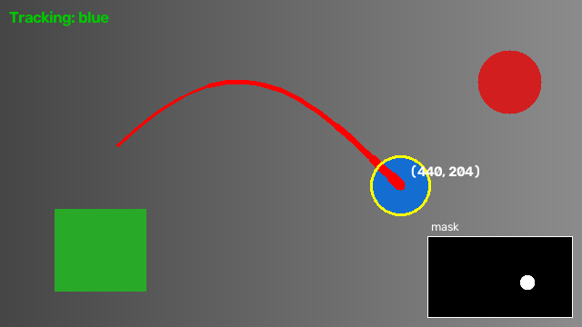
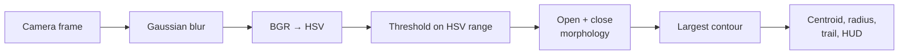

# Color Tracker

[](https://github.com/Read405/Color-tracker/actions/workflows/ci.yml)


Real-time color tracking from your webcam, running entirely on your device. Pick a color and Color Tracker follows the object that has it. It marks the object's position and draws the path it has taken.


<sub>The image is generated by <code>scripts/render_demo.py</code>. It runs the real detection pipeline and overlay on a synthetic scene: the blue ball is tracked, and the red and green shapes are ignored.</sub>

## Features

- **Three ways to choose a color:** built-in presets, an exact HSV range, or clicking on an object in the live feed.
- **Handles red correctly:** hue wraps around at red, so red uses two ranges. Without that, a tracker only catches half of it.
- **Noise-resistant:** blur and morphological filtering remove speckles, and blobs below a size threshold are ignored.
- **Live HUD:** shows the object's position, a fading motion trail, an FPS counter, and an optional mask view for tuning.
- **Private by design:** no network calls, and nothing is saved or uploaded.
- **Works with video files:** point `--source` at a recording for demos without a camera.

## Quick start

```bash
git clone https://github.com/Read405/Color-tracker.git
cd Color-tracker
python -m venv .venv && source .venv/bin/activate   # Windows: .venv\Scripts\activate
pip install -e .

color-tracker --color blue
```

## Usage

```bash
color-tracker --color green                      # presets: red, orange, yellow, green, blue, purple, pink
color-tracker --hsv 35 80 60 85 255 255          # custom range: lower H S V, upper H S V (H is 0-179)
color-tracker                                    # no color given: click an object to track it
color-tracker --source demo.mp4 --color red      # track in a video file
```

| Option | Default | Description |
| --- | --- | --- |
| `--color NAME` | none | Track a preset color |
| `--hsv HL SL VL HU SU VU` | none | Track a custom HSV range |
| `--source SRC` | `0` | Camera index or path to a video file |
| `--min-area PX` | `300` | Ignore blobs smaller than this many pixels |
| `--trail N` | `32` | Length of the motion trail |
| `--no-mirror` | off | Don't flip the image horizontally |

### Controls

| Input | Action |
| --- | --- |
| Left click | Sample the color under the cursor and track it |
| `m` | Toggle the mask window, useful for tuning HSV ranges |
| `c` | Clear the motion trail |
| `q` / `Esc` | Quit |

## How it works



1. **Preprocess:** a Gaussian blur smooths out sensor noise. The frame then moves to HSV, where a color's *hue* is separate from its brightness, so lighting changes don't break tracking.
2. **Threshold:** every pixel inside the target range becomes white in a binary mask. Red is split into two ranges because hue wraps from 179 back to 0.
3. **Clean up:** a morphological *open* removes isolated speckles, and a *close* fills small holes in the object.
4. **Locate:** the largest contour is the target. Its centroid comes from image moments, and a minimum enclosing circle gives its size.
5. **Render:** the HUD draws the target marker, coordinates, and a trail that thins as points get older.

## Project structure

```
Color-tracker/
├── src/color_tracker/
│   ├── colors.py       # Color presets and HSV range construction
│   ├── detection.py    # Frame pipeline: blur → HSV → mask → largest blob
│   ├── overlay.py      # HUD drawing (trail, marker, status line)
│   └── app.py          # CLI and interactive capture loop
├── tests/              # Unit tests on synthetic frames (no camera needed)
├── scripts/            # Demo-image generator
├── docs/               # README assets
└── pyproject.toml      # Packaging, dependencies, tool config
```

The detection code is written as pure functions that take a frame and return a result. That lets it be tested with no camera or GUI, and reused in other projects:

```python
from color_tracker import PRESETS, track_frame

detection, mask = track_frame(frame_bgr, PRESETS["blue"])
if detection:
    print(detection.center, detection.radius)
```

## Development

```bash
pip install -e ".[dev]"
pytest              # run the test suite
ruff check .        # lint
ruff format .       # format
python scripts/render_demo.py   # regenerate docs/demo.png
```

CI runs lint and tests on Python 3.10, 3.11, and 3.12 for every push and pull request.

## Possible extensions

- Track several colors at once, each with its own trail
- Smooth the motion with a Kalman filter
- Save the tracked coordinates to CSV for later analysis
